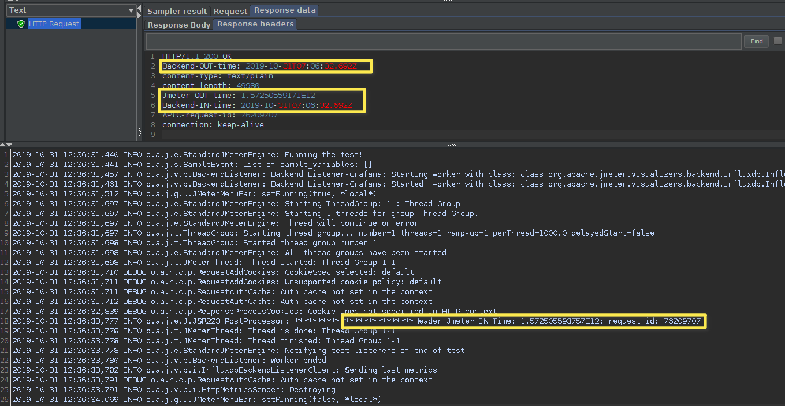
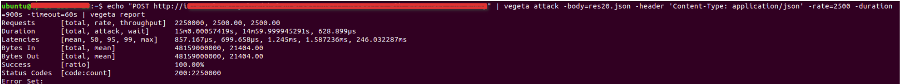
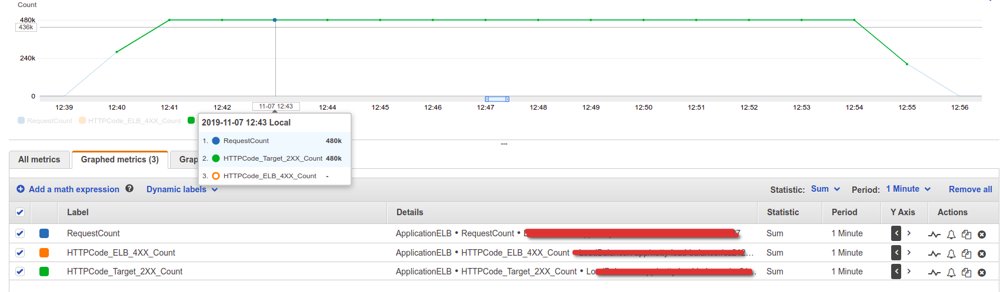

# netty-http-echo-service
HTTP Echo Service developed using [Netty](https://netty.io/wiki/user-guide-for-4.x.html). A very useful debugging and measurement tool is an echo service. An echo service simply sends back to the originating source any data it receives. 


#Performance Test with Jmeter.
This is useful for performance tests. This will give the response time for:
   * Client to backend server
   * Server processing time
   * Backend to Client
   
# How to use
* Install Jmeter in your machine.
* Start the Echo server
* Run the jmeter script in the 'jmeter_script' folder

Following is a sample screenshot of a request. Please note that the timestamp is in UTC.



# Limitations

There will be an upper bound of the supported ```rate``` which varies on the machine being used. You could be CPU bound (unlikely), memory bound (more likely) or have system resource limits being reached which ought to be tuned for the process execution. The important limits for us are file descriptors and processes. On a UNIX system you can get and set the current soft-limit values for a user.

```
$ ulimit -n # file descriptors
2560
$ ulimit -u # processes / threads
709
```
# Sample Test summary

This test was done using [Vegeta](https://github.com/tsenart/vegeta), an open source application written in the [Go programming language](https://www.scaleway.com/en/docs/installation-golang-on-ubuntu/), to run load testings on an application.

* Transactions per second : 8000
* Payload size : 20KB
* Duration : 15 min
* Success rate : 100%
* Response time (95th percentile): 7.99725 milliseconds

Vegeta test results:



Load Balancer results:


